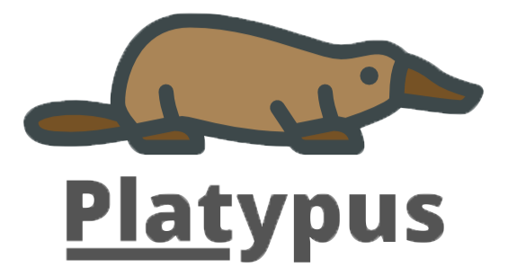

# Platypus




Platypus is a browser extension that shows you what CVEs the website you're viewing is vulnerable to.

## Usage

You'll need [Python 3](https://www.python.org/downloads/), [Git](https://git-scm.com/downloads), and [Docker](https://www.docker.com/products/docker-desktop) on your system. This will allow you to install and run the development environment for Platypus.

Clone the Platypus app from GitHub and execute `./run,sh` in your favorite shell.

```bash
git clone https://www.github.com/gideontong/SLO-Hacks-2020.git
cd SLO-Hacks-2020
./run.sh
```

Then, install the Python dependencies in the `server` folder.

```bash
cd server
pip install -r requirements.txt
python server.py
```

The Python server is now running, so you can start the Chrome extension by unpacking the developer version of the extension in Chrome.

```bash
./run.sh build 5.9.24
cd build
unzip extension.zip
```

## License

Platypus is licensed under the [MIT License](/LICENSE). However, it is based off of an application called Wappalyzer, and code from this repository is licensed under the [GPL](https://github.com/AliasIO/Wappalyzer/blob/master/LICENSE).

## Documentation

Please read the [developer documentation](https://www.wappalyzer.com/docs) to get started.
